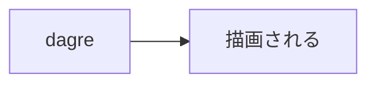

# ELK レイアウト(未対応)

Mermaid の ELK レイアウト(`layout: elk`)は、EPL-2.0 の `elkjs` が必要なため、HyperBuf には同梱していません。
この図は、図の位置にエラーとして表示され、文書の残りは、そのまま読めます。

```mermaid
---
config:
  layout: elk
---
flowchart LR
  A[開始] --> B[終了]
```

## 通常のレイアウトの図(描画される)

```mermaid
flowchart LR
  X[dagre] --> Y[描画される]
```
